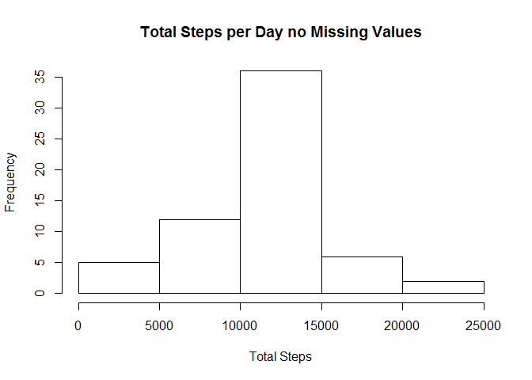

# Reproducible Research: Peer Assessment 1


## Loading and preprocessing the data


```r
library(ggplot2)
library(lattice)
setwd("~/GitHub/RepData_PeerAssessment1")
if (!file.exists("activity.csv")) {
    unzip("activity.zip")
}

activity <- read.csv('activity.csv')

activity$date <- as.Date(activity$date, format = "%Y-%m-%d")
```


## What is mean total number of steps taken per day?


```r
stepsperday <- tapply(activity$steps, activity$date, sum, na.rm=TRUE)
```


```r
hist(stepsperday, main='Total Steps by Day', xlab='Steps')
```

<!-- -->


```r
mean(stepsperday, na.rm= TRUE)
```

```
## [1] 9354.23
```

```r
median(stepsperday, na.rm=TRUE)
```

```
## [1] 10395
```


## What is the average daily activity pattern?

```r
meanstepsbyint <- aggregate(steps ~ interval, data=activity, FUN=mean)
```


```r
plot(meanstepsbyint, type='l', main='Avg Steps Taken by Interval', xlab='5 Min Intervals', ylab='Avg Steps Taken')
```

<!-- -->


```r
meanstepsbyint$interval[which.max(meanstepsbyint$steps)]
```

```
## [1] 835
```

## Imputing missing values


```r
nullval<-which(is.na(activity))
length(nullval)
```

```
## [1] 2304
```


```r
actrepmerge <- merge(activity, meanstepsbyint, by = "interval", suffixes = c("",     ".y"))
nullval2 <- is.na(actrepmerge$steps)
actrepmerge$steps[nullval2] <- actrepmerge$steps.y[nullval2]
actrepmerge <- actrepmerge[, c(1:3)]
```


```r
actwnonulls <- tapply(actrepmerge$steps, actrepmerge$date, sum, na.rm=TRUE) 
hist(actwnonulls, main = "Total Steps per Day no Missing Values", xlab = "Total Steps" )
```

<!-- -->


```r
mean(actwnonulls, na.rm = TRUE)
```

```
## [1] 10766.19
```

```r
median(actwnonulls, na.rm = TRUE)
```

```
## [1] 10766.19
```
## Are there differences in activity patterns between weekdays and weekends?


```r
weekdayorend <- function(date) {
    if (weekdays(as.Date(date)) %in% c("Saturday", "Sunday")) {
        "weekend"
    } else {
        "weekday"
    }
}
actrepmerge$wday <- as.factor(sapply(actrepmerge$date, FUN=weekdayorend))
```


```r
actbywkday <- aggregate(actrepmerge$steps, by=list(actrepmerge$wday, actrepmerge$interval), mean)


names(actbywkday) <- c("wday", "interval", "steps")
xyplot(steps ~ interval | wday, actbywkday, type = "l", layout = c(1,2),
       xlab = "Interval", ylab = "Number of Steps")
```

<!-- -->
